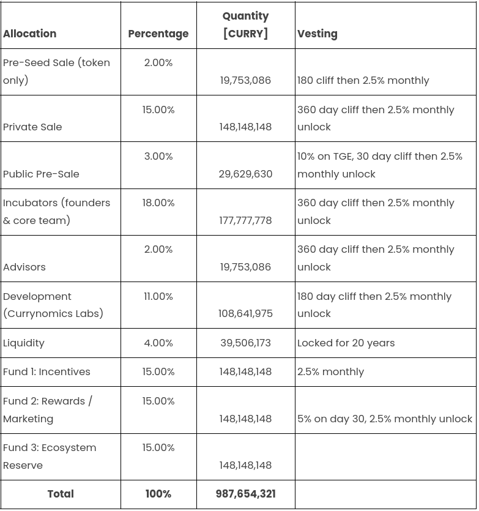
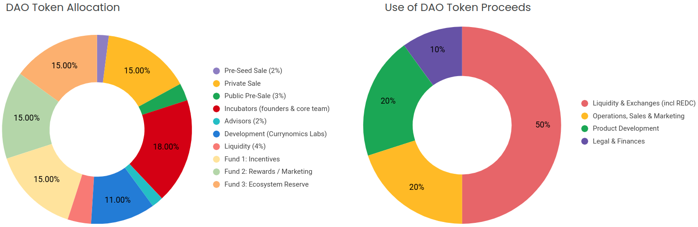

# DAO Economics
## DAO Token Distribution
Distribution first begins with two rounds of private sales, and then continues with the public sale through the distribution partners. According to our current relevant financial plan, our private sale round cap is 5 000 000€.

## Revenue
There are many sources of fees in the infrastructure. These fees are important to guarantee protocol sustainability. Part of the fees are routed through a contract that first exchanges the fees for the governance token. These tokens are then split between the DAO Main Treasury and Operational Budget Treasury based on a parameter set by the DAO Governance.

## Treasury
The DAO main treasury will hold all of the liquidity that is initially provided by the protocol. This will include both liquidity for the DAO Governance token as well as Redcurry liquidity. Assets in this treasury can only be utilized by an agreement between core contributor multisig holders and a DAO Snapshot vote.

Initially, the fee allocation directed to the main treasury will automatically be used to deploy more governance token liquidity.

### Operational Treasury
The DAO operational budget treasury is a core contributor-controlled multisig used for paying contributors, tooling, marketing, and any other expenses that Currynomics DAO will require to keep the protocol healthy, relevant, and operational.

### RedCurry Liquidity Pools Treasury 
Redcurry tokens possess their own treasury containing the underlying assets backing the pool. The DAO has no direct control over this treasury and it’s fully managed by code.

<a href="https://redcurry.co/manifesto" target="_blank">
    <button class="nextButton" >
        

            
Next

            
Manifesto

        

        
<i class="material-icons">open_in_new</i>

    </button>
</a>

<!-- [Next: Manifesto (leave)](https://redcurry.co/manifesto) -->