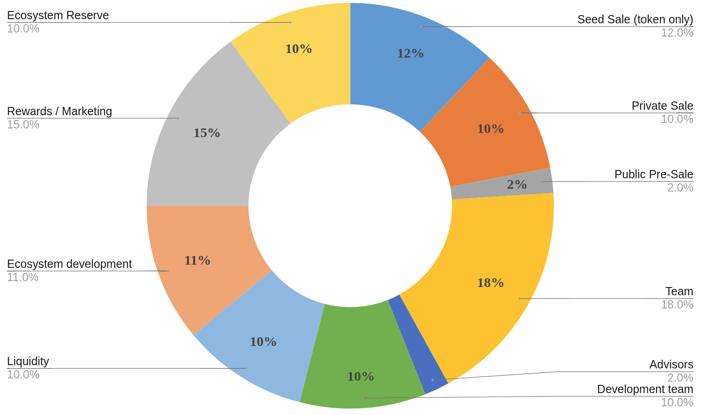
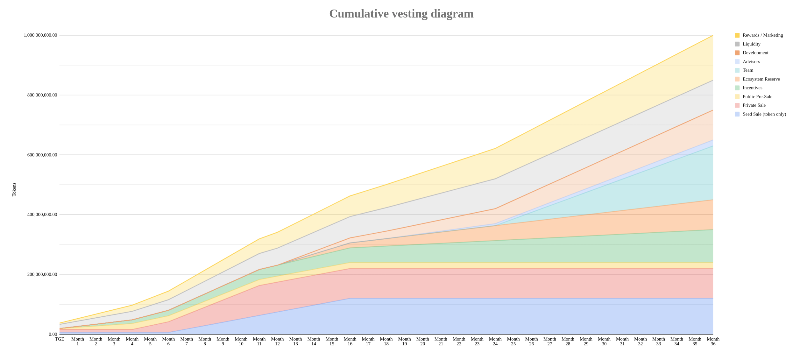

# Tokenomics
Blockchain technology has received significant attention for its technological aspects, such as consensus mechanisms. However, tokenomics— the study of token supply, distribution, incentives, and utility—has been largely overlooked in academic research.

Tokenomics plays a crucial role in the long-term viability of a blockchain ecosystem. Poor tokenomics design has caused the failure of many major projects.

A well-designed tokenomics should be stable, incentivizing, sustainable, and adaptive to business environments and user demand. This chapter uncovers the decision-making process of designing Currynomics DAO tokenomics and address the following questions:
* How was Currynomics DAO token economy tokenomics designed?
* What are the aspects of the token release schedule?
* What are the mechanisms of token distribution?
* What are the mechanisms for ensuring token price sustainability?

## Token issuance
**Currynomics DAO tokens can be purchased before the launch of the ecosystem (pre-launch)**, which will
help to secure a critical mass of early interested users. We do not not see a problem
in the threat of over-supplying the DAO tokens, since the effective token supply can
later be adjusted with various mechanisms such as increasing the price for participating
in governance. **The DAO token follows a deflationary valuation trajectory with a fixed cap for the token supply**.

Below are the details of the DAO token's supply, pricing, and distribution:

* Maximum supply: 1 000 000 000
* Initial public market capitalization: $20,000,000.00
* Seed sale price: $0.013 (40.91% discount)
* Private sale price: $0.018 (18.18% discount)
* Initial public pre-sale price: $0.222 (no discount)

## Token Distribution
Token distribution methods are crucial for governance tokens, determining the number of users who can exercise control over the token economy. There are several approaches:

1. Private sale: Selling tokens to a small group of investors, often at a discount, to raise capital quickly and maintain control over token holders.
2. Public sale: Selling tokens to the general public through ICOs or IEOs, helping to raise funds, provide early users access to tokens, and build a larger community of supporters.
3. Airdrop: Distributing tokens publicly for free to promote the project or increase adoption, creating a large community of users and gaining awareness. However, voting power may go to uninterested or unqualified token holders.

Conducting a public sale of the DAO token not only complements the Redcurry token but also bolsters its demand. The DAO token will be initially distributed before its launch.

*Currynomics DAO Token distribution graph*

## Token Vesting
The Currynomics DAO token follows a vesting period before its full distribution. During the vesting period, the tokens are gradually released to the token holders. The specific details of the vesting and token release period for the DAO token are as follows:

*Cumulative vesting period*

## Revenue
A variety of fee sources within the infrastructure are crucial for ensuring protocol sustainability. These fees are partially directed through a contract that first converts them into governance tokens. Following this, the tokens are allocated between the DAO Main Treasury and Operational Budget Treasury based on parameters initially set by the Currynomics board and later adjusted via the DAO Governance mechanism.

### Main treasury
The DAO Main Treasury holds all initial liquidity supplied by the protocol, including liquidity for both the DAO Governance token and Redcurry liquidity. The usage of assets in this treasury depends on agreements made between Currynomics board members and affected by DAO proposals and votes.

Initially, the fee allocation channelled to the main treasury will be automatically utilised to boost DAO token liquidity.

### Operational treasury
The DAO Operational Budget Treasury, controlled by core contributors via a multisig arrangement, is designated for disbursing payments to contributors, acquiring tools, marketing, and addressing any additional expenses required to preserve the protocol's health, relevance, and operation within Currynomics DAO.

### Liquidity treasury
Redcurry tokens possess a separate treasury containing the underlying assets that back the pool. The DAO does not have direct authority over this treasury, as it is fully managed by code.

### Revenue channels
DAO revenues are generated through the following channels

* DAO Token sale proceeds
* Reserve asset management fees (such as commercial real estate commissions and rental yields)
* DAO token transaction tax
* Redcurry token transaction tax
* Redcurry token DEX liquidity provider rewards
* DAO token DEX liquidity provider rewards

<a href="/#/asset/dao/voting">
    <button class="nextButton" >
        

            
Next

            
Voting Mechanisms

        

        
<i class="material-icons">arrow_forward</i>

    </button>
</a>

<!-- [Next: Manifesto (leave)](https://redcurry.co/manifesto) -->