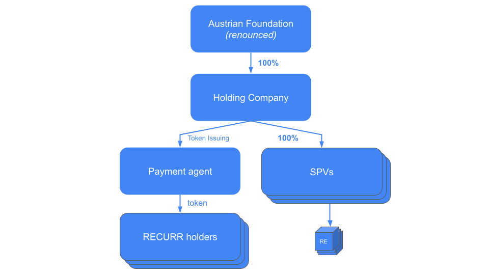

## Managing The Portfolio
The Holding company is a pure investment holding without any real-estate-related operative activities. The costs of the Holding company are covered solely by rental income received via owned SPVs (as dividends) or RE Funds. 

At a later stage, SPVs might be grouped in regional / country holding companies, if that is desirable for operative management or tax reasons. However, the generation of tax advantages will never be a primary goal. The approach to taxation shall be one of fairness and sustainability and balance all interests. 

SPVs will always distribute their profits as far as possible to the Holding company. The SPVs will hold only so much liquidity, as is necessary to fulfill the CAPEX plans, repayment schedules of bank loans (if any), and other needs from day-to-day business. 

The SPVs will have only a minimal share capital. All other equity shall be provided (if possible) by contributions to capital reserves or similar structures so that equity can easily be returned if there is sufficient liquidity.

All SPVs must in all cases be structured as fully non-recourse i.e., no guarantees of any kind to other group companies or third parties. 

Real estate will be acquired by asset deals or share deals. As the intention is to hold real estate for a long period, latent capital gains taxes may be accepted with a market standard discount. Real estate transactions may also include more than one property, however, preference will be given to the principle of “one SPV – one property”

To avoid lump risks, properties acquired will not be too big concerning the total real estate portfolio. The aim should be that once the portfolio size reaches 500M Euro or more, a single property (but not necessarily a single transaction) shall constitute not more than 10% of the total portfolio value. Balancing of risks over properties, markets and regions shall be ensured.

[Next (RE Preferences)](/asset/real/preferences.md)