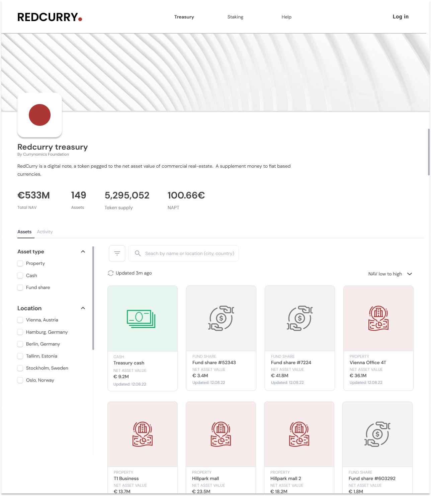
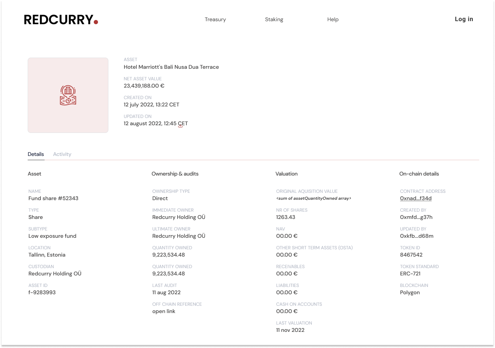

# Redcurry Explorer
Redcurry explorer is a web3 application designed to provide a window into the assets that are backing the Redcurry token. The dashboard shows all the assets and their changelog, their respective NAV and the token supply on a single dashboard.

The following is a screenshot view of the dashboard welcome screen.

*Screenshot 1: Dashboard welcome screen showing Redcurry’s assets under management*

Each asset has its own details view, there anybody can see the history of the asset changes. 

*Screenshot 2: Dashboard asset details view*

As the assets are red directly from the blockchain, the same details can be confirmed using a public blockchain explorer (e.g.polygonscan.com) by searching for the Proof Of Reservers smart contract address).

[Next: Legal Structure](/legal/overview.md)
