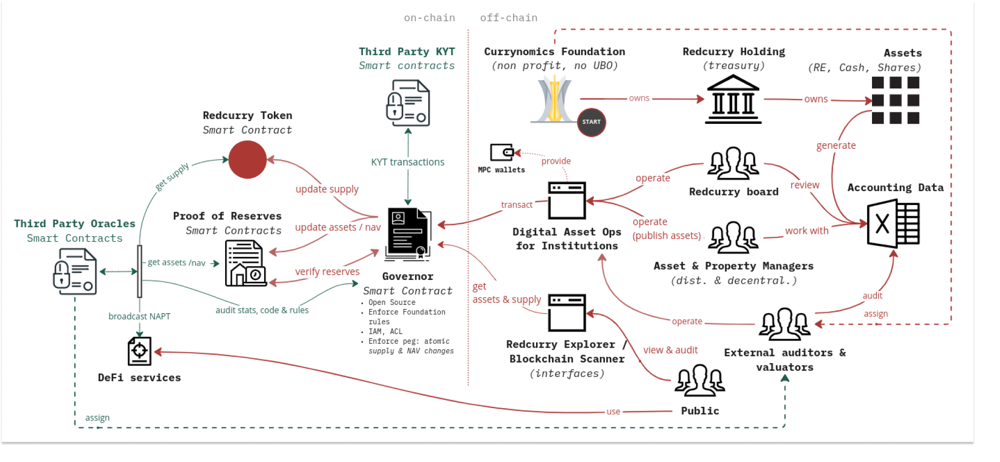

# Overview

For running the Redcurry asset management infrastructure, the goal is to publish the most important information used for the treasury net asset value (NAV) calculations.

The primary purpose of an on-chain asset tracking system is to introduce transparency, decentralization, and immutability into the otherwise seemingly centralized accounting systems of a fund. Another reason for on-chain asset tracking is to progress towards a fully trustless, and ultimately fully decentralized reporting, governance, and decision-making system.

To better understand the requirements set on Redcurry’s asset tracking architecture, read the [Asset Management Principles](/asset/treasury/treasury.md).

Redcurry currency token is pegged to the treasury NAV. Any change to the NAV without updates to supply will affect the currency's value. For the system to be trusted, its NAV must be published on a decentralized, distributed, immutable and trustless system - a public blockchain - following a process similar in design.  

In other words, It would make little sense to use decentralized systems only to find full centralization at the data source. 

As a result, our reporting system is developed so that all the essential pieces of information needed for NAV calculations, and which are derived from the extensive amounts of accounting data, are managed and published by a decentralized group of people in a publicly auditable manner. 

The following diagram represent the high level architecture or Redcurry’s asset tracking and reporting system.

*Diagram 1: decentralized and distributed asset management architecture.*

All smart contracts will be developed on an EVM compatible blockchain. Redcurry and DAO governance tokens will be implemented using the ERC20 standard the asset reporting smart contracts using the ERC720 standard.

The product has to successfully carry out the following requirements:
* Meet the requirements defined in the Currynomics cybersecurity principles.
* Allow secure and transparent reporting of Redcurry token reserve assets (making up the NAV) on-chain. The assets making up the NAV can be the following:
    * Cash
        * Cash on accounts
        * RedCurry Holding or subsidiary company receivables and liabilities
    * Non-cash
        * Real estate portfolio
        * Fund shares or equity
        * Consolidated asset group
* Allow for secure and transparent pegging of Redcurry tokens to Treasury NAV. This includes:
    * NAV reporting and updates (update assets on-chain).
    * Token supply updates (minting and burning of Redcurry tokens).
    * Both NAV and Supply change has to be an atomic operation (with exceptions).
    * Smart contract management framework for managing access, keeping logs, and monitoring the activity of smart contracts.
    * Public dashboard as a window into the on-chain data (Redcurry explorer).
    * Development and security operations of smart contracts
    * Institutional grade MPC wallet management.

[Next: Asset Management](/asset/technology/management.md)
