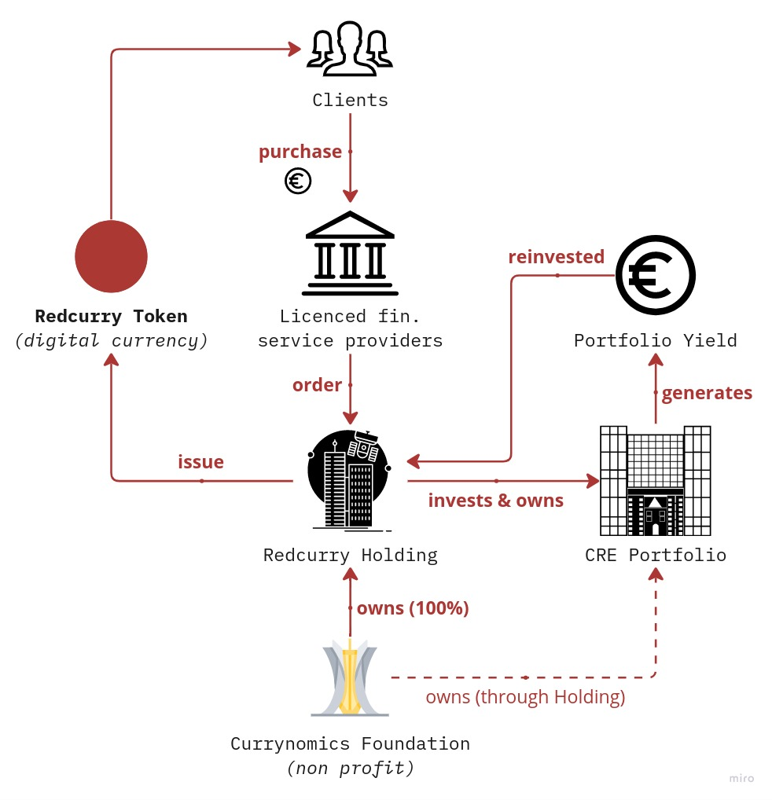

# Abstract
Meet Redcurry: Your steadfast companion in the ever-shifting world of finance. It’s not just another digital currency; it’s a sanctuary of stability, a guardian of your wealth, always at your fingertips, ensuring that your investments are not only protected but also nurtured to flourish.

Imagine having a kind of money that combines the simplicity and independence of digital currencies like Bitcoin with the solid reliability of commercial real estate. Redcurry is precisely that - a new kind of asset that’s designed to be as easy to use as Bitcoin, yet firmly anchored in the real-world value of diverse commercial properties.

In a world where the value of money often feels like it’s on a rollercoaster ride due to inflation and market volatility, Redcurry offers a serene and secure journey. It’s like having a superpower that shields your wealth from the unpredictability of markets and the erosion of inflation. It’s crafted not just as a currency, but as a steadfast guardian of your wealth, ensuring that your money retains its purchasing power and is always ready whenever you need it.

Redcurry is here to empower you, whether you’re a seasoned investor or just someone looking for a safe and sensible place to store your wealth. It’s not merely about having money in a digital form; it’s about having money that’s nurtured by the enduring value of commercial real estate, ensuring that it’s not just maintained, but allowed to grow.

In the vast universe of investment options, Redcurry shines brightly with a unique charm. It’s not just another currency lost in the volatility of digital markets, nor is it a traditional fiat currency that loses its warmth with inflation or a complex security hard to crasp and predict. Redcurry is a harmonious blend of accessibility and stability, a currency that’s backed by the tangible prosperity of commercial real estate, offering a warm embrace of security and growth to storing your wealth.

So, welcome to the world of Redcurry, where your wealth is not just stored, but cherished and cultivated, ensuring that it’s always there for you, stable and flourishing.

*Redcurry portfolio generation and cash movement cycle*

<a href="/#/whitepaper/intro">
    <button class="nextButton" >
        

            
Next

            
Introduction

        

        
<i class="material-icons">arrow_forward</i>

    </button>
</a>

<a href="https://redcurry.co" target="_blank">Website</a> | <a href="https://t.me/RedcurryOfficial" target="_blank">Telegram</a> | <a href="https://discord.gg/z8kgCvxtea" target="_blank">Discord</a> | <a href="https://www.linkedin.com/company/86164816" target="_blank">LinkedIn</a> | <a href="https://redcurry.co/manifesto" target="_blank">Manifesto</a> 

<!-- [Next: Principles](whitepaper/manifesto.md) -->
