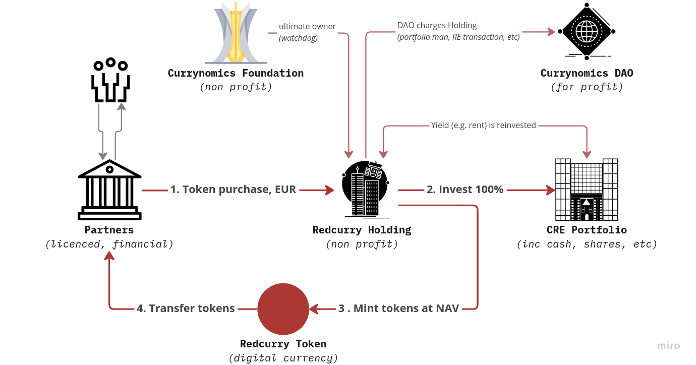

# How it works
The fundamental concept behind Redcurry is to create a currency (or means of payment), which is appreciating in value, and without making it a security. To disqualify as a security, the Redcurry token cannot provide Redcurry token holders with any rights to the assets backing its value. [Read more on the legalities of Redcurry](/asset/legal/overview.md). 

But if the Redcurry token does not represent any rights, how is the value of it backed by real estate? The solution is enabled by the legal structure below and the [technology](/asset/technology/overview.md) described in the later chapters.

Redcurry Holding is the legal entity issuing the Redcurry token. With the sale of a Redcurry token, Redcurry Holding earns money, which it is obliged to invest solely into commercial real estate. This step ensures a permanent balance between Redcurry tokens issued and real estate value owned by Redcurry Holding. 

To achieve the linking of the Redcurry Token to the real estate assets, it is imperative that no money or value can leave Redcurry Holding. For this purpose, the ownership structure above Redcurry Holding is created with the non-profit Currynomics Foundation as the sole shareholder. 

The Currynomics Foundation ensures that Redcurry Holding company does not distribute dividends and that Redcurry Holding invests all proceeds into real estate. Effectively, Redcurry Holding is a locked box where all sales proceeds of Redcurry tokens ever generated are stored, in the form of real estate and cash. The only way cash leaves Redcurry Holding, is when it buys back Redcurry tokens and burns them. And this can only take place at the respective Net Asset Value per token, so no dilution effect occurs. [Read more about the Currynomics Foundation and Redcurry Holding.](/asset/legal/overview?id=currynomics-foundation)

The process of minting Redcurry tokens follows a few simple rules:

* Redcurry is a means of payment, and therefore Redcurry tokens will only be sold through partners who are licensed financial service providers. Visit our Website to find out where Redcurry tokens can be bought.
* Redcurry tokens are only issued/minted by Redcurry Holding when there is demand for more Redcurry tokens and Redcurry Holding has opportunities to invest in suitable real estate. Redcurry Holding will never accumulate cash positions beyond a certain threshold (long-term target is 10% of total assets in cash).
* Redcurry tokens can only be issued/minted or destroyed/burned by Redcurry Holding and only at the actual Net Asset Value per token; therefore, no dilution of value can occur at any point in the increase or decrease of the supply of Redcurry tokens.

The Redcurry system has no expiration date, Redcurry tokens can be acquired or sold at any time and held indefinitely. Also, the minting of new Redcurry tokens can be repeated indefinitely at any time. Redcurry Holding may also buy at any time Redcurry tokens and burn them. However, the Holding can never be obliged to do so, as the Redcurry tokens holders do not hold any rights to demand so. The effect of this principle is that no market pressure can be exerted on the real estate portfolio of Redcurry Holding, and thus also not on the NAV per tokens. In other words, a bank run event cannot occur.

Even though Redcurry does not have any expiration date, the Currynomics Foundation board may at a certain point of time decide to end the Redcurry system as a whole, when it concludes that maintaining the Redcurry ecosystem is no longer attractive for Redcurry token holders. At such a point, Redcurry Holding will start selling its real estate assets and buying back and burning all Redcurry tokens minted, again at the current NAV per token. At the end of this process, no assets will remain in Redcurry Holding or the Currynomics Foundation, and all proceeds from the real estate assets will have reached the Redcurry token owners. In other words, the sales proceeds of all real estate owned by Redcurry Holding are the buy-back capital for all Redcurry tokens ever minted. 

<a href="/#/whitepaper/benefits">
    <button class="nextButton" >
        

            
Next

            
Benefits & Use Cases

        

        
<i class="material-icons">arrow_forward</i>

    </button>
</a>

<!-- [Next: Benefits & Use Cases](whitepaper/benefits.md) -->