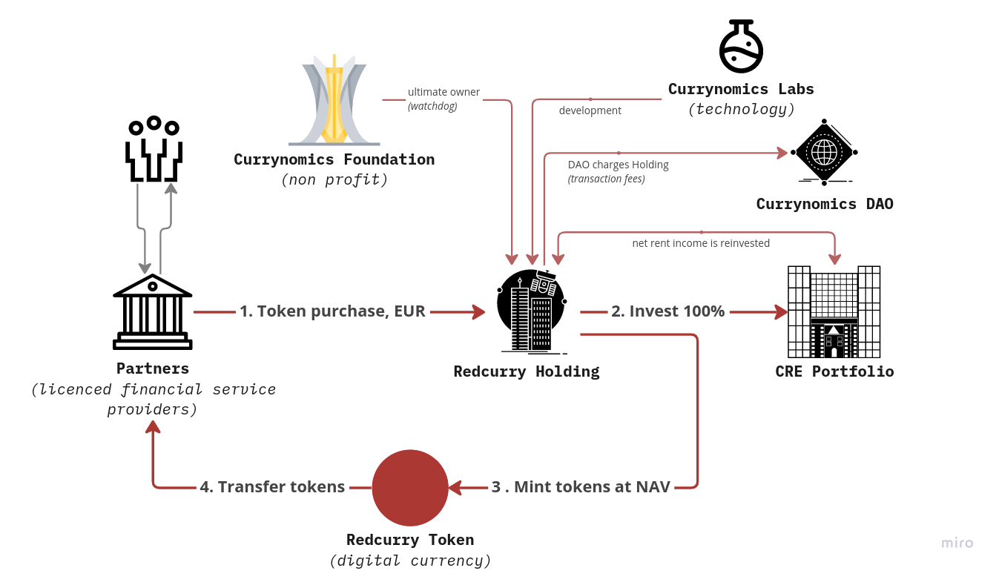

# How it works
RedCurry is a blend of securities and money. As not a security, it is designed as a means of payment, definitiveness of investment (a share you bought you can sell, but not return to someone or redeem against something), and return on investment through business exposure.

It does not have any other functionality; specifically, it does not represent any rights to anything. The RedCurry Token token only transports the underlying real estate portfolio’s NAV. This also creates the face value of the token. From that comes the store of value property which is a crucial prerequisite for any hard money and means of payment.

The Holding is the legal entity issuing the RedCurry Token token. By the sale of the REDS, the Holding earns money, which it is obliged to invest solely into commercial real estate. This step ensures the balance between the RedCurry Tokens issued and the real estate NAV owned by the Holding. To achieve the backing of the RedCurry Token by the real estate assets, it is imperative that no money leaves the Holding. For this purpose, the ownership structure above the Holding is created with a non-profit Foundation as the sole shareholder. Ultimately the sales proceeds of all real estate owned by the Holding are the buy-back capital for the RedCurry Token. A deeper look at the Foundation and the Holding reveals why this structure is effectively ensuring the above. Read more about [legal structure](/docs/structure.md).

<!-- [Next](whitepaper/price.md) -->
[Next](minting/minting.md)