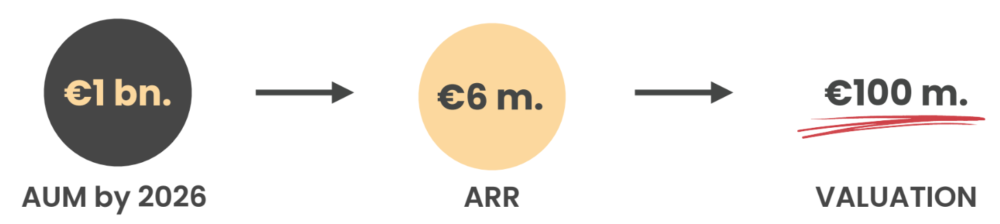

# This Is How We Make Money
To maintain protocol sustainability, harness growth, and reinvest in the platform's capabilities, Redcurry incorporates multiple revenue streams. By strategically positioning these streams across different facets of the platform's operations, we ensure a well-rounded and efficient monetization model.

Here's a more in-depth look into our revenue channels:

* Real Estate Management Fee (**0.25% from AUM**):
This fee ensures that the real estate assets under Redcurry's management are maintained, upgraded, and monitored to maintain their value.
These fees cater to costs associated with property management, upkeep, and any necessary renovations.

* Commission on RE Transactions (**0.3% per transaction**):
This commission is levied whenever a real estate transaction occurs within the Redcurry ecosystem, whether it's buying or selling of properties.
These fees cover due diligence, brokerage, and other associated transaction costs.

* Redcurry Token Transaction Fees (**0.02% per transaction**):
As Redcurry tokens are transferred, exchanged, or utilized within the ecosystem, this fee acts as a small revenue source.
This revenue helps in maintaining the blockchain infrastructure, ensuring swift and secure token transactions.

* Governance Token Transaction Fees (**0.5% per transaction**):
As governance tokens play a crucial role in protocol decision-making, their transactions carry a slightly higher fee.
The revenue generated is primarily used to fund future protocol upgrades, enhancements, and community initiatives.

* Liquidity Provider (LP) Rewards:
Liquidity providers, who enable fluidity within the Redcurry ecosystem by staking their assets, are incentivized through rewards.
These rewards not only ensure ample liquidity within the platform but also encourage more participants to engage, thereby strengthening the ecosystem.

By diversifying our revenue streams and embedding them within our core functionalities, Redcurry ensures both profitability and a perpetual commitment to protocol improvement and growth.

<a href="/#/whitepaper/team">
    <button class="nextButton" >
        

            
Next

            
Team

        

        
<i class="material-icons">arrow_forward</i>

    </button>
</a>
<!-- [Next: Redcurry vs Other Instruments](/whitepaper/compare.md) -->
