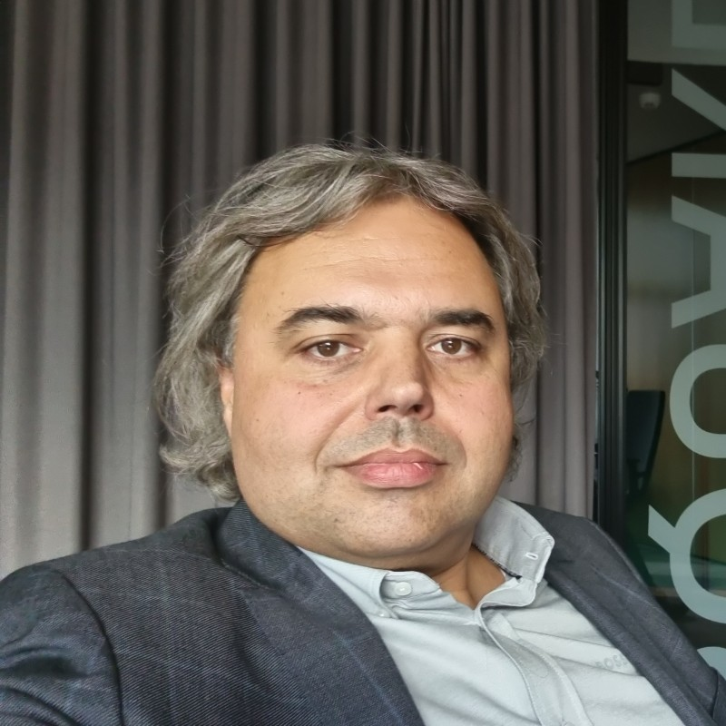
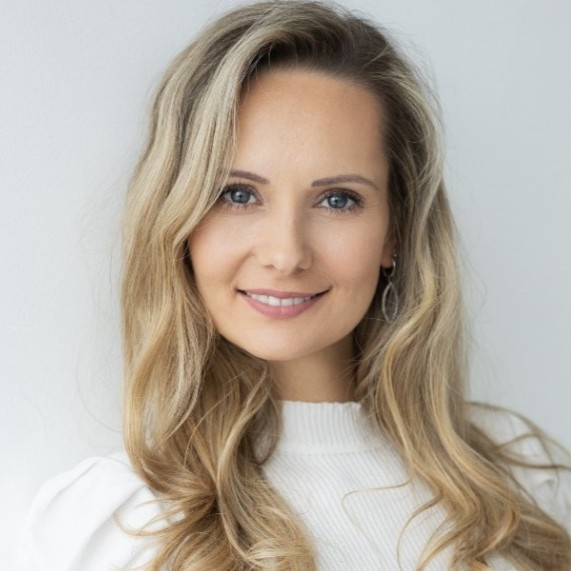

# Team
Behind every revolutionary idea is a team of visionaries who bring it to life. Meet the individuals who have combined their expertise and passion to create Redcurry:

## Neeme Liivlaid
CEO, Co-founder

Neeme is a passionate strategist, always on the hunt for efficient solutions to age-old challenges. His current ambition? To redefine financial freedom with Redcurry—a currency backed by commercial real estate.

Highlights:
* Co-founder of ByBlock, a DeFi platform countering legacy market limitations.
* Champion of Redcurry, a safeguard against inflation.
* A history marked by real estate, innovation, and entrepreneurship—19 years and counting.

Experience:
Neeme's entrepreneurial journey started in 2003 when he co-founded a holiday letting service in Estonia. By 2006, he stepped into the UK property market with Goodson & Red. His digital footprints began with Nutriplanet, a health blog, and took a significant turn with Moowle in proptech. By 2021, ByBlock and Redcurry came into the picture, both altering the financial landscape.

[Connect with Neeme](https://meetings-eu1.hubspot.com/meetings/neeme)

## Dejan Mansfeld-Rupnik
Chief Investment Officer, Co-founder

With an impressive tenure of 25 years, Dejan serves on the Board at ECE European City Estates Group. His vast experience and deep insights into the investment world are pivotal to Redcurry's direction and success.

## Kaspar Triebstok
CTO, Co-founder

Kaspar's technological journey is defined by innovation and an unwavering curiosity. His mission with Redcurry is to grant universal access to a genuine store of value.

Highlights:
* Co-founder & CTO of Redcurry Digital Currency at Currynomics.
* Tech Advisor for Duuabl, transitioning the construction economy.
* CTO at Moowle, which revolutionized renting.

Experience:
Starting in Estonia with the rental game-changer, Moowle, Kaspar expanded his horizons to Indonesia with Nordic Tech, a software engineering school and as the interim CTO for Danabijak, a FinTech initiative. Back in Estonia, he also contributed to academia as a lecturer at the Tallinn University of Technology.

# Mari Raudsepp
CBDO

From banking to business development, Mari's career is a tapestry of rich experiences and diverse roles. Her global exposure, spanning Australia to the Middle East, has sharpened her skills and expanded her network.

Highlights:

* A core member of Currynomics, the driving force behind RedCurry.
* Expertise in sales, investor relations, business development, and psychology.

Philosophy:
For Mari, growth is continuous. It's about gaining perspectives, challenging norms, and constantly seeking innovative solutions.

## Asse Sauga
Partnerships, Co-founder

Blockchain expert, tech enthusiast, and a visionary leader—Asse's impressive track record spans a multitude of projects across Estonia and the European Union.

Highlights:
* Pioneered Estonia's Mobile Payment System based on Bitcoin Blockchain.
* Part of Estonia's landmark Digital Signature Application project.
* Founder of the Estonian Cryptocurrency Association.

Philosophy:
Through blockchain technology, Asse envisions a world where tech simplification becomes a right, not a luxury. His brainchild, Proof of You, is set to redefine contract management and legal compliance.

Each member of the Redcurry team brings a unique set of skills, experiences, and visions to the table, collaboratively pushing boundaries and pioneering change in the financial landscape.

<a href="/#/whitepaper/compare">
    <button class="nextButton" >
        

            
Next

            
Redcurry vs Other Instruments

        

        
<i class="material-icons">arrow_forward</i>

    </button>
</a>

<!-- [Next: Redcurry vs Other Instruments](/whitepaper/compare.md) -->
